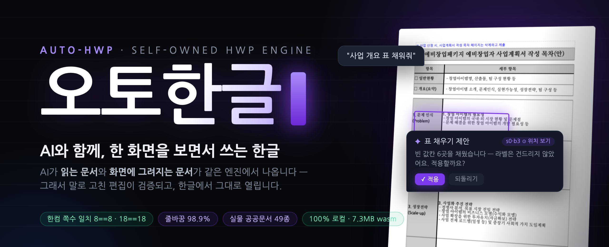

<p align="center"></p>

# auto-hwp (오토한글)

**Writing HWP together with AI — on one shared screen.** Open a `.hwp`/`.hwpx` and it renders
faithfully; point at a block or just talk, the AI proposes edits, you see exactly where they land,
approve — and it becomes the document. Everything runs 100% locally (WebAssembly · MCP · CLI).

[한국어](./README.md) · [Live demo](https://kwakseongjae.github.io/auto-hwp/) ·
[Embed guide](./docs/EMBED-GUIDE.md) · [MCP](./docs/MCP-GUIDE.md) · [Contributing](./CONTRIBUTING.md)

## To AI, HWP has been an invisible document

The existing way to feed HWP to an LLM is text extraction. It works — and at that moment the
document splits into two worlds: **what the AI read** (plain text) and **what a human sees**
(the typeset page). The AI can't tell where "the blank cell in table 3" is on screen, and nobody
can guarantee its edit didn't break the layout. For government forms — where **the layout IS the
content** — that gap is fatal.

So auto-hwp makes a structural choice: own the engine, not wrap a viewer. Parse → typeset →
render → edit → save all run on **one IR (SemanticDoc)**:

```
.hwp / .hwpx ──▶ SemanticDoc (IR) ──▶ typesetter ──▶ SVG pages (screen · hit-testing)
                      │                          ├▶ PDF (layout-preserving, krilla)
                      │                          └▶ doc profile · Markdown (what the AI reads)
                      └── Intent JSON ──▶ Op ──▶ IR mutation (edit · undo/redo) ──▶ HWPX save
```

That one line of architecture buys three properties at the AI-perception level:

**① What the AI reads = what gets drawn.** On upload the engine deterministically extracts a
**document profile** (title, outline, table inventory, body excerpt — zero LLM calls) and attaches
it to every request. A profile address like `[s0/b3]` shares the **same IR coordinates** as the
block on screen, so "add a row to the first table" lands on the right block with nothing marked.
Extraction-only pipelines have no such coordinate system to begin with.

**② The AI's hands are typed Intents, not free text.** The model can only emit whitelisted
**Intent JSON** (19 kinds — find&replace, char format, tables, charts, margins…), and only what
passes schema validation + unknown-field rejection reaches the document through the op-bus — one
undo unit each. Proposals preview as cards with **"reveal target"** before you approve. There is
structurally no path for model output to silently corrupt a document.

**③ The result is verified in numbers.** Owning the renderer means "it worked" is measurable:
page counts match Hancom's renderer exactly on real government forms (**8==8 · 18==18**),
line-break positions match **98.9%+** as CI invariants, and untouched content re-serializes
**byte-for-byte**. "The AI-edited file opens identically in Hancom" is a gate, not a slogan.

None of the three holds without owning the renderer — which is why we rebuilt a typesetter
instead of wrapping someone else's viewer.

## Packages (npm)

| Package | Layer | Role |
|---|---|---|
| **`@auto-hwp/engine`** | L1 | **headless engine (wasm)** — parse · typeset · SVG/HTML/PDF/HWPX · Intent edits · undo. No UI |
| `@auto-hwp/editor-core` | L2 | headless editor state (selection/edit/session) — DOM-minimal, framework-free |
| `@auto-hwp/ai-protocol` | L2′ | vendor-neutral LLM protocol for vibe-editing (prompt/context/validate) — no fetch, no keys |
| `@auto-hwp/react` | L3 | **optional**: reference editor `<HwpWorkspace/>` + React bindings |

```bash
npm i @auto-hwp/engine            # headless only
npm i @auto-hwp/react @auto-hwp/engine @auto-hwp/editor-core @auto-hwp/ai-protocol
```

Full embed recipe (static wasm serving, CSP, fonts, AI proxy): [docs/EMBED-GUIDE.md](./docs/EMBED-GUIDE.md) ·
working example: [examples/vite-embed](./examples/vite-embed).

## Quick start ① — headless engine only (bring your own UI)

No React, no reference editor. The engine hands you SVG strings and bytes:

```js
import { initEngine, HwpDoc } from '@auto-hwp/engine';

await initEngine();                          // instantiate the wasm module once
const bytes = new Uint8Array(await file.arrayBuffer());
const doc = HwpDoc.open(bytes, file.name);   // .hwp / .hwpx auto-detected

// render — one SVG string per page; where and how to draw is yours
for (let p = 0; p < doc.pageCount(); p++) {
  container.insertAdjacentHTML('beforeend', doc.renderPageSvgSanitized(p));
}

// edit — Intent JSON (schema v0, docs/INTENT-SCHEMA.md)
doc.applyIntent({ intent: 'SetTableCell', section: 0, index: 1, row: 0, col: 0, text: 'value' });
doc.undo();

// export
const html = doc.exportHtml();               // semantic-reflow HTML
const pdf  = doc.exportPdf();                // layout-preserving PDF (Uint8Array)
const hwpx = doc.toHwpx();                   // round-trip-safe HWPX (Uint8Array)

doc.free();
```

Geometry queries (`hitTest`/`tableAt`/`blocksInRect`…) — 27 methods in total — are documented
as the [`EngineAdapter` contract](./packages/editor-core/src/adapter.ts), enough to build a
**fully custom editor** with click-selection, dragging and carets on top of the engine.
If you want a middle layer, use `@auto-hwp/editor-core` (selection model + edit controller,
framework-free).

## Quick start ② — reference editor (React)

```tsx
import { HwpWorkspace, WasmAdapter } from '@auto-hwp/react';
import '@auto-hwp/react/styles.css';

<HwpWorkspace
  adapter={adapter}                 // WasmAdapter (web) or your own adapter
  document={{ bytes, name }}
  enableEditing
  onAiRequest={myLlmBridge}         // optional vibe-editing — the LLM runs on YOUR server (BYOK)
/>
```

Full embed recipe (static wasm/worker serving, CSP, fonts, AI proxy):
[`docs/EMBED-GUIDE.md`](./docs/EMBED-GUIDE.md) · working example: [`examples/vite-embed`](./examples/vite-embed) ·
AI proxy example: [`examples/ai-proxy-express`](./examples/ai-proxy-express).

## Use it from AI tools / the terminal (no site, fully local)

- **MCP server** — attach to Claude Code/Desktop or Cursor: `cargo install --git
  https://github.com/kwakseongjae/auto-hwp hwp-mcp --features rhwp` → `claude mcp add auto-hwp -- hwp-mcp`.
  15 tools (open / structured context / preview→approve edits / find&replace / undo / HWPX·PDF export).
  Documents never leave your machine. → [docs/MCP-GUIDE.md](docs/MCP-GUIDE.md)
- **Claude Code skill** — `cp -r skills/hwp ~/.claude/skills/`, then in any session: "convert this
  hwp to pdf". Wraps the local `auto-hwp` CLI. → [skills/hwp/SKILL.md](skills/hwp/SKILL.md)

## Run the demo locally

```bash
git clone --recurse-submodules https://github.com/kwakseongjae/auto-hwp
cd auto-hwp

# build the engine wasm (Rust + wasm-bindgen — see CONTRIBUTING.md)
cargo build -p hwp-wasm --profile wasm-size --target wasm32-unknown-unknown
wasm-bindgen --target web --out-dir packages/engine/pkg target/wasm32-unknown-unknown/wasm-size/hwp_wasm.wasm

# demo app
cd apps/hwp-lab && npm install && npm run dev   # http://localhost:3000
```

For vibe-editing (AI), put `OPENROUTER_API_KEY` in `apps/hwp-lab/.env.local` — the key lives
only in the server route and never reaches the client bundle.

## Vibe editing (AI)

Click a cell/paragraph/table to anchor it — or **just talk**: on upload the engine attaches a
deterministic **document profile** (title, structure counts, outline, table inventory, body
excerpt — zero LLM calls) to every request, so "add a row to the first table" targets the right
block with nothing marked. The LLM returns **Intent JSON** (a 19-intent whitelist — including
document-wide find&replace, char formatting, column widths, page margins) that the engine
validates and applies. Proposals preview as cards with **"reveal target"** (scroll + flash the
affected block) and per-card revert.

- LLM calls always happen on **your server** (BYOK — no package in this repo ever sees an API key)
- model output touches the document only after schema validation + unknown-field rejection
- agentic mode: web search → cited evidence → streamed edit proposals

## Design note — what is canonical

The original plan was "HWP → XML (structure) + CSS (design) → the LLM picks which side to
edit". During implementation this pivoted to a **format-neutral IR (SemanticDoc) + typed
Intent edits** ([`docs/PIVOT-DESIGN.md`](./docs/PIVOT-DESIGN.md)):

- the render truth is **SemanticDoc → typeset → SVG** (comparable pixel-for-pixel with Hancom)
- the edit truth is **Intent JSON → Op → IR mutation** (schema-locked LLM output — more
  verifiable than free-form XML/CSS patches, with exact undo)
- the XML+CSS view survives as the optional [`hwp-jsx`](./crates/hwp-jsx) codec
  (JSX/CSS projection, round-trip-verified); HTML export descends from it

The goal — "the LLM detects whether to touch structure or design" — is intact; the medium
is typed Intents rather than XML/CSS text.

## Accuracy

| Benchmark | Hancom render | auto-hwp | Verdict |
|---|---|---|---|
| benchmark.hwp (gov form, 8pp) | 8 pages | 8 pages | ✅ match |
| benchmark1.hwp (application form, 18pp) | 18 pages | 18 pages | ✅ match |
| line-break position match | — | 98.9%+ | gate |

`scripts/verify-local.sh` enforces the gate on every commit. Beyond the gate, **49 real
government documents** (startup-program forms, notices, press releases — [sources](./corpus/GOV-SOURCES.md))
pass the full open→render→PDF→text pipeline; measured at 130 pages, edit→screen is 136ms on a
worker thread, and undo memory is capped by a size-aware budget (128MiB). For lossy `.hwpx` conversions
(Hancom's own "save as .hwpx" collapses line spacing and row heights), a **layout-recovery**
mode detects the degradation fingerprint and restores an approximation of the original.

**Known limitations (honest disclosure)**
- **Equations & charts in PDF**: rendered for real on screen/HTML, but the PDF backend
  cannot vectorize them yet — they export as **placeholder boxes** (the app warns you
  before exporting). SVG→PDF vectorization is on the roadmap.
- **Password-protected `.hwp`**: not supported — refused honestly. (Distribution-DRM
  documents ARE decrypted — `hwp-crypto`.)
- **No binary `.hwp` re-save**: the save format is HWPX. Editing a `.hwp` also downloads
  as HWPX (untouched HWPX regions stay byte-identical).

## Rust crates (engine internals)

`hwp-model` (IR) · `hwp-hwpx` (HWPX codec) · `hwp-rhwp` (.hwp parse bootstrap,
[rhwp](https://github.com/kwakseongjae/rhwp) MIT) · `hwp-typeset` (kinsoku · width/letter
spacing · old Hangul) · `hwp-render` (PaintOp→SVG) · `hwp-export` (PDF/HTML) · `hwp-ops`
(op-bus · undo) · `hwp-mcp` (Intent schema) · `hwp-session` (geometry) · `hwp-wasm`
(bindings) · `hwp-crypto` (distribution-copy decryption) · `auto-hwp-cli` (CLI)

The CLI works standalone:

```bash
cargo run -p auto-hwp-cli --features rhwp -- own-render doc.hwp --out page.svg
cargo run -p auto-hwp-cli --features rhwp -- export-pdf doc.hwpx -o out.pdf
```

## License

MIT OR Apache-2.0 ([LICENSE-MIT](./LICENSE-MIT) / [LICENSE-APACHE](./LICENSE-APACHE)).
Third-party notices in [NOTICE](./NOTICE) — rhwp (MIT), Nanum fonts (OFL), and how the
GPL oracle is kept out-of-process.
