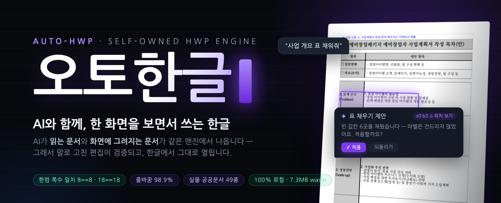
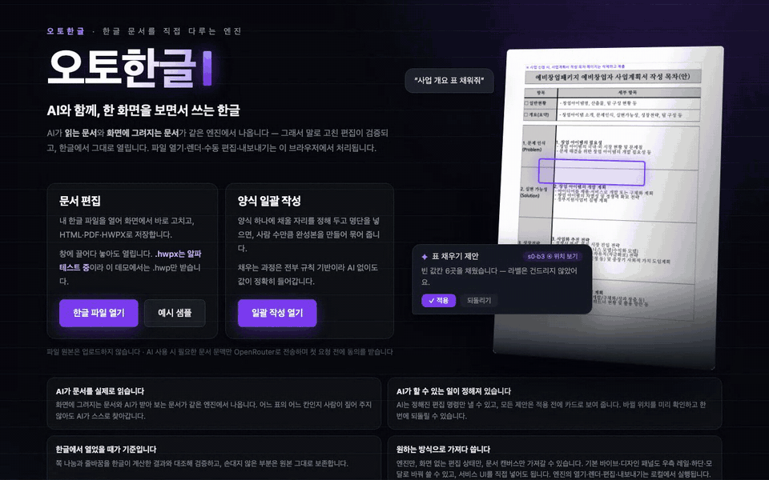
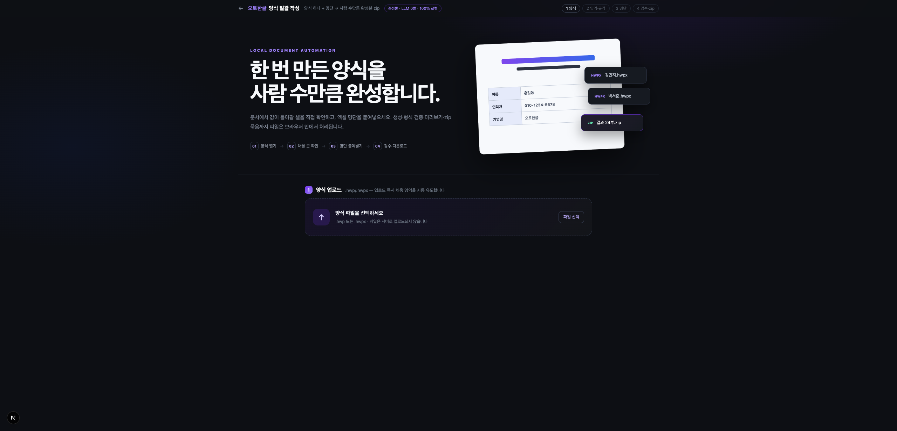
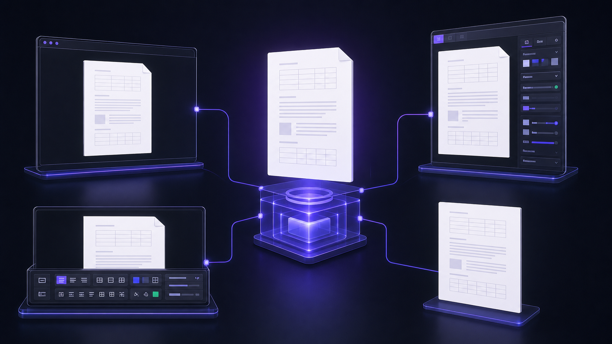

<p align="center"></p>

# 오토한글 (auto-hwp)

**한글(HWP/HWPX) 문서를 직접 다루는 엔진.** 파일을 열고, 원본대로 그리고, 구조를 바꾸고,
PDF·HTML·HWPX로 내보냅니다. 화면·AI·터미널이 전부 **같은 엔진** 위에서 돕니다.
엔진 자체에는 서버가 없습니다 — WebAssembly·MCP·CLI로 사용자의 컴퓨터에서 실행됩니다.
라이브 데모의 선택형 AI 편집만 별도 프록시를 거쳐 모델 제공자를 호출합니다.

이 저장소가 배포하는 것은 **엔진과 SDK**입니다. 아래 데모는 그 엔진으로 만든 참조 구현이지
여러분이 써야 할 화면이 아닙니다 — **화면은 여러분이 조립합니다.**

[English](./README.en.md) · [라이브 데모](https://kwakseongjae.github.io/auto-hwp/) ·
[벤치마크](https://kwakseongjae.github.io/auto-hwp/bench/) · [임베드](./docs/EMBED-GUIDE.md) ·
[CLI](./docs/CLI-GUIDE.md) · [MCP](./docs/MCP-GUIDE.md) ·
[양식 일괄 작성](./docs/BULK-GUIDE.md) · [기여](./CONTRIBUTING.md)

<p align="center"></p>
<p align="center"><sub>라이브 데모 실제 화면(2026-07) — 샘플 열기 → 표 지정 → 말로 편집 → 제안 카드 확인 후 적용 → PDF 내보내기 직전까지.
모델 응답을 기다리는 구간은 빨리 감았습니다.</sub></p>

## 60초 만에 붙이기

```bash
npm i @auto-hwp/react                 # 엔진(@auto-hwp/engine)·헤드리스 코어가 함께 설치됩니다
mkdir -p public/hwp && cp node_modules/@auto-hwp/engine/pkg/hwp_wasm_bg.wasm public/hwp/
```

```tsx
import { useMemo, useState } from 'react';
import { HwpWorkspace, WasmAdapter, workspacePanel, type HwpWorkspaceProps } from '@auto-hwp/react';
import '@auto-hwp/react/styles.css';

// LLM 호출은 당신 서버에서 — 이 저장소의 어떤 패키지도 API 키를 보지 않습니다(BYOK).
const askAi: HwpWorkspaceProps['onAiRequest'] = async (instruction, anchors, docContext) => {
  const res = await fetch('/api/hwp-edit', {
    method: 'POST',
    body: JSON.stringify({ instruction, anchors, docContext }),
  });
  return res.json();                  // 검증된 편집 명령(Intent) 배열
};

export function Editor() {
  const adapter = useMemo(() => new WasmAdapter('/hwp/hwp_wasm_bg.wasm'), []);
  const [doc, setDoc] = useState<{ bytes: Uint8Array; name: string } | null>(null);

  return (
    <>
      <input type="file" accept=".hwp,.hwpx" onChange={async (e) => {
        const f = e.currentTarget.files?.[0];
        if (f) setDoc({ bytes: new Uint8Array(await f.arrayBuffer()), name: f.name });
      }} />
      <HwpWorkspace
        adapter={adapter}
        document={doc}
        enableEditing
        onAiRequest={askAi}
        sidePanel={workspacePanel({ onAiRequest: askAi })}
      />
    </>
  );
}
```

이게 전부입니다 — 열기·조판·렌더·수동 편집·HTML/PDF/HWPX 내보내기가 이 컴포넌트 안에서 돕니다.
`sidePanel`을 빼면 패널 없는 순수 에디터가 됩니다(그때 `onAiRequest`는 호출되지 않습니다).
React 없이 엔진만 쓰는 예제는 [아래](#npm-패키지--엔진만-쓰기)에, 번들러별 wasm 서빙·워커·CSP·폰트·AI
프록시 레시피는 [`docs/EMBED-GUIDE.md`](./docs/EMBED-GUIDE.md)에 있습니다.

## 다른 오픈소스와 무엇이 다른가

| | **auto-hwp** | rhwp | hwp.js |
|---|---|---|---|
| **라이선스** | MIT OR Apache-2.0 — 상용 임베드 무료, 동시접속 제한 없음 | MIT | Apache-2.0 |
| React 네이티브 SDK | `@auto-hwp/react`의 `<HwpWorkspace/>` + 헤드리스 코어(`@auto-hwp/editor-core`) | iframe 임베드 웹 컴포넌트(`@rhwp/editor`) | 뷰어·파서 라이브러리(`hwp.js`) |
| 양식 일괄 작성 완제품 | 웹 + CLI (양식 1개 + 명단 N행 → 완성본 N부 zip) | 확인되지 않음 | 확인되지 않음 |
| 바이브(자연어) 편집 | 타입드 편집 명령 19종 · 적용 전 카드 미리보기 · 카드별 되돌리기 | 확인되지 않음 | 확인되지 않음 |
| 충실도 자동 게이트 | 쪽수·줄바꿈 일치율을 커밋마다 검사 ([정확도](#정확도와-한계)) | 확인되지 않음 | 확인되지 않음 |
| 배포 표면 | npm · CLI · MCP 서버 · Claude Code 스킬 · 웹 데모 | 브라우저 확장(Chrome/Edge/Firefox) · VS Code 확장 · npm · 웹 데모 | npm |
| 최근 npm 릴리스 | `@auto-hwp/engine` 0.0.2 (2026-07) | `@rhwp/core` 0.8.2 (2026-07) | `hwp.js` 0.0.3 (2020-10) |

<sub>2026-07 기준, 각 프로젝트의 공개 저장소와 npm 레지스트리 메타데이터에서 확인한 것만 적었습니다.
"확인되지 않음"은 공개 자료에서 찾지 못했다는 뜻이지 불가능하다는 뜻이 아닙니다. rhwp는 auto-hwp가
`.hwp` 파싱 부트스트랩으로 쓰는 상류이기도 합니다([NOTICE](./NOTICE)).</sub>

**왜 지금인가** — 2026년 5월 18일부터 지방정부 온나라시스템에도 개방형 포맷(HWPX) 첨부 의무가
확대됐습니다(중앙부처는 2022년부터,
[ZDNet](https://zdnet.co.kr/view/?no=20260512173412)). auto-hwp는 `.hwp`와 `.hwpx`를 같은 문서 모델로
열고 HWPX로 저장하며, AI가 읽는 창(문서 프로필)과 화면에 그려지는 지면이 같은 엔진에서 나옵니다 —
다만 `.hwpx` **입력**은 아직 알파입니다(아래 [정확도와 한계](#정확도와-한계)).

## 설치 없이 웹에서 써보기

| 데모 | 하는 일 | 링크 |
|---|---|---|
| **문서 편집** | 한글 파일을 열어 화면에서 고치고 HTML·PDF·HWPX로 저장 | [열기](https://kwakseongjae.github.io/auto-hwp/) |
| **양식 일괄 작성** | 양식 1개 + 명단 N행 → 완성본 N부 zip (규칙 기반, AI 없이 동작) | [열기](https://kwakseongjae.github.io/auto-hwp/bulk) · [가이드](./docs/BULK-GUIDE.md) |

<p align="center"></p>

파일 원본과 열기·렌더·수동 편집·내보내기는 브라우저 안에서 처리됩니다(원본 업로드 없음).
다만 라이브 데모에서 **AI 편집을 선택하면**, 사용자가 입력한 지시와 문서 프로필·본문 발췌·표/선택
문맥이 Cloudflare Worker를 거쳐 OpenRouter(GLM 5.2)로 전송됩니다. 첫 요청 전에 동의를 받고,
파일 원본 전체는 보내지 않습니다.
데모는 현재 `.hwp`만 받습니다 — `.hwpx` 입력은 알파 단계입니다.

## 왜 엔진을 직접 만들었나

LLM에게 한글 문서를 주는 기존 방법은 결국 **텍스트 추출**입니다. 추출은 됩니다 — 그런데 그 순간
문서가 둘로 갈라집니다. **AI가 읽은 것**(평문)과 **사람이 보는 것**(조판된 지면)이 서로 다른
표현이라, AI는 "3번 표의 빈칸"이 화면 어디인지 모르고, 고친 결과가 레이아웃을 깨뜨렸는지 아무도
보증하지 못합니다. 서식 자체가 내용인 공문서·신청서에서 이 간극은 치명적입니다.

그래서 파서도 뷰어도 아닌 **엔진을 소유**합니다. 열기부터 저장까지 **하나의 문서 모델** 위에서 돕니다:

```
.hwp / .hwpx ──▶ 문서 모델 ──▶ 조판 ──▶ 페이지 SVG (화면 · 좌표 질의)
                    │                 ├▶ PDF (레이아웃 보존)
                    │                 └▶ 문서 프로필 · Markdown (AI가 읽는 창)
                    └── 편집 명령 ──▶ 문서 변경 (되돌리기 포함) ──▶ HWPX 저장
```

여기서 세 가지가 따라 나옵니다. ① **AI가 읽는 것 = 화면에 그려지는 것** — 프로필의 주소 `[s0/b3]`은
화면의 그 블록과 같은 좌표라, 마킹 없이 "첫 번째 표에 행 추가해줘"가 정확한 블록에 꽂힙니다.
② **편집은 화이트리스트 명령만** — 모델은 자유 텍스트가 아니라 검증된 편집 명령만 낼 수 있습니다.
③ **결과를 수치로 검증** — 쪽수·줄바꿈 일치율이 CI 게이트로 잠겨 있습니다(아래 [정확도](#정확도와-한계)).

## 엔진이 할 수 있는 일

| 능력 | 무엇을 주나 | 엔진 API · CLI |
|---|---|---|
| **열기** | `.hwp`(HWP5)·`.hwpx` 자동 감지 → 편집 가능한 문서 모델. 배포용(DRM) 문서 복호 | `HwpDoc.open` · `auto-hwp info` |
| **조판** | 한글 조판 규칙 재구현(금칙 처리·장평·자간·옛한글), 쪽 나눔과 표의 행 단위 분할 포함 | `pageCount` · `auto-hwp layout-check` |
| **렌더** | 페이지별 SVG 문자열. 어디에 어떻게 그릴지는 호스트 자유 | `renderPageSvgSanitized` · `auto-hwp own-render` |
| **좌표 질의** | 점 → 블록·표·셀·글자 히트테스트, 표 열/행 경계, 커서 사각형, 사각형 안 블록 | `hitTest` · `tableCellAt` · `caretRectCell` · `blocksInRect` |
| **구조화 편집** | 셀·문단 채우기, 표/문단/차트/이미지 삽입, 행 추가, 블록 이동·삭제, 찾아바꾸기, 글자서식, 표 열폭, 쪽 여백 — 전부 타입 있는 편집 명령(Intent)이고 각각 되돌리기 1단위 | `applyIntent` · `undo`/`redo` |
| **문서 프로필** | 제목·목차·표 인벤토리·본문 발췌를 결정론으로 추출(LLM 호출 0회) — AI 컨텍스트의 정본 | `docProfile` · `auto-hwp ai-context` |
| **표 그리드** | 표를 행·열·병합·텍스트가 담긴 격자로 노출 — 양식 채우기의 기반 | `tableGrid` |
| **내보내기** | PDF(레이아웃 보존·한글 폰트 임베드) · HTML(시맨틱 리플로) · HWPX(고치지 않은 영역은 바이트 그대로) | `exportPdf`·`exportHtml`·`toHwpx` · `auto-hwp export-pdf`/`export-html` |
| **서체 주입** | TTF/OTF 바이트를 등록하면 조판·화면·PDF가 **동시에** 그 서체로 | `registerFont` |
| **양식 일괄 채움** | 양식 + 채울 자리 정의 + 명단 → 완성본 N부 + 행별 검증 리포트 | `auto-hwp inspect`/`fill` · [가이드](./docs/BULK-GUIDE.md) |

없는 것도 분명합니다 — 표의 행 삭제·열 삽입·열 삭제 명령은 **없습니다**(정직하게 비워 둡니다).
전체 명령 스펙은 [`docs/INTENT-SCHEMA.md`](./docs/INTENT-SCHEMA.md).

## 가져다 쓰는 네 가지 방법

| 방법 | 이럴 때 | 시작 |
|---|---|---|
| **npm 임베드** | 내 웹앱 안에서 문서를 열고 그리고 고친다 | `npm i @auto-hwp/engine` → [임베드 가이드](./docs/EMBED-GUIDE.md) |
| **CLI** | 터미널·스크립트·배치 변환, 양식 일괄 작성 | `cargo install --git https://github.com/kwakseongjae/auto-hwp auto-hwp-cli --features rhwp,shaper,pdf` → [CLI 가이드](./docs/CLI-GUIDE.md) |
| **MCP 서버** | Claude Code/Desktop·Cursor에 상시 장착 | `cargo install --git https://github.com/kwakseongjae/auto-hwp hwp-mcp --features rhwp` → [MCP 가이드](./docs/MCP-GUIDE.md) |
| **Claude Code 스킬** | 아무 세션에서 "이 hwp를 pdf로" | `cp -r skills/hwp ~/.claude/skills/` → [스킬 정의](./skills/hwp/SKILL.md) |

CLI·MCP·스킬은 전부 로컬 실행입니다 — 문서가 컴퓨터를 떠나지 않습니다.

## npm 패키지 — 엔진만 쓰기

| 패키지 | 레이어 | 역할 |
|---|---|---|
| **`@auto-hwp/engine`** | L1 | **엔진(wasm)** — 열기·조판·SVG/HTML/PDF/HWPX·편집·되돌리기. 화면 코드 없음 |
| `@auto-hwp/editor-core` | L2 | 화면 없는 에디터 상태(선택·편집·세션) — DOM 최소, React 무관 |
| `@auto-hwp/ai-protocol` | L2′ | AI 편집 프로토콜(프롬프트·컨텍스트·검증) — 네트워크 호출 없음, 키 없음 |
| `@auto-hwp/react` | L3 | **선택** 레이어: 참조 에디터 `<HwpWorkspace/>` + React 바인딩 |

React도, 우리 에디터도 필요 없습니다. 엔진은 SVG 문자열과 바이트를 돌려줍니다:

```js
import { initEngine, HwpDoc } from '@auto-hwp/engine';

await initEngine();                          // wasm 1회 인스턴스화
const bytes = new Uint8Array(await file.arrayBuffer());
const doc = HwpDoc.open(bytes, file.name);   // .hwp / .hwpx 자동 감지

// 렌더 — 페이지별 SVG 문자열. 어디에 어떻게 그릴지는 당신의 자유.
for (let p = 0; p < doc.pageCount(); p++) {
  container.insertAdjacentHTML('beforeend', doc.renderPageSvgSanitized(p));
}

// 편집 — 편집 명령(Intent) JSON. 스키마는 docs/INTENT-SCHEMA.md
doc.applyIntent({ intent: 'SetTableCell', section: 0, index: 1, row: 0, col: 0, text: '값' });
doc.undo();

// 내보내기
const html = doc.exportHtml();               // 시맨틱 리플로 HTML
const pdf  = doc.exportPdf();                // 레이아웃 보존 PDF (Uint8Array)
const hwpx = doc.toHwpx();                   // 고치지 않은 영역은 바이트 그대로 (Uint8Array)

doc.free();
```

좌표 질의까지 포함한 **34개 메서드**가 [`EngineAdapter` 계약](./packages/editor-core/src/adapter.ts)으로
문서화되어 있어, 클릭 선택·드래그·커서가 있는 **완전한 자체 에디터**를 엔진 위에 지을 수 있습니다.
중간층이 필요하면 `@auto-hwp/editor-core`(선택 모델·편집 컨트롤러, React 무관)를 쓰세요.
전체 임베드 레시피(wasm 정적 서빙·CSP·폰트·AI 프록시)는 [`docs/EMBED-GUIDE.md`](./docs/EMBED-GUIDE.md),
동작 예제는 [`examples/vite-embed`](./examples/vite-embed)입니다.

## 화면은 당신이 조립합니다

<p align="center"></p>
<p align="center"><sub>문서 엔진은 하나, 제품 셸은 자유롭게 — 기본 UI를 바로 쓰거나 필요한 부분만 가져갑니다.</sub></p>

참조 에디터 `<HwpWorkspace/>`도 **문서 표면만** 소유합니다 — 페이지·선택·오버레이·수동 편집.
오른쪽 패널은 슬롯입니다. 채팅을 넣든, 입력 폼을 넣든, 인스펙터를 넣든, 아무것도 안 넣든 호스트 마음입니다.

```tsx
import { HwpWorkspace, WasmAdapter } from '@auto-hwp/react';
import '@auto-hwp/react/styles.css';

<HwpWorkspace
  adapter={adapter}                 // WasmAdapter (웹) 또는 자체 어댑터
  document={{ bytes, name }}
  enableEditing
  onAiRequest={myLlmBridge}         // LLM 호출은 당신 서버에서 (BYOK)
  sidePanel={(api) => <MyPanel {...api} />}   // 화면은 당신 것
/>
```

처음부터 디자인할 필요는 없습니다. `workspacePanel()`은 바이브 편집+디자인 인스펙터가 담긴 기본 UI이고,
배치만 `"rail"`(기본)·`"bottom"`·`"modal"`·`"unstyled"` 중에서 고릅니다.

```tsx
import { workspacePanel } from '@auto-hwp/react';

<HwpWorkspace
  {...props}
  sidePanel={workspacePanel({ onAiRequest: myLlmBridge, presentation: 'bottom' })}
/>
```

더 자유롭게 조립할 때는 `WorkspacePanelFrame` 안에 자신의 폼을 넣거나, 슬롯에서 React portal을 반환해
워크스페이스 밖의 어느 DOM에든 패널을 마운트할 수 있습니다. `WorkspacePanel`의 `tab`·`open`은 제어형/
비제어형을 모두 지원하므로 앱 라우터나 단축키 상태와 연결할 수 있습니다. `sidePanel`을 생략하면 패널 없는
순수 에디터입니다. 즉 **엔진 → 헤드리스 editor-core → 문서 표면 → 선택형 기본 셸**을 필요한 깊이까지만
가져갑니다.

슬롯이 호스트에게 넘기는 값
([`WorkspaceSidePanel`](./packages/react/src/components/HwpWorkspace.tsx)) 전부:

| 값 | 무엇 |
|---|---|
| `canEdit` | 문서가 열려 있고 편집 가능한가 (false면 입력을 잠그면 됩니다) |
| `anchors` | 사용자가 지금 지정한 위치들 — 문서 컨텍스트와 **같은** `[s/b]` 주소 |
| `modLabel` | 플랫폼 보조키 표기(`⌘` / `Ctrl`) |
| `removeAnchor(i)` | 지정한 위치 하나 제거 |
| `clearAnchors()` | 지정 위치 전체 해제 |
| `docContext` | AI에 넘길 문서 컨텍스트(문서 프로필 + 지정 위치 + 표 그리드) |
| `apply(intents)` | 검증된 편집 명령을 적용하고 반영된 개수를 돌려준다 |
| `jumpToPage(p)` | 해당 쪽으로 스크롤(0부터) |
| `revealTarget(s, b)` | 해당 블록으로 스크롤 + 깜빡임 ("위치 보기") |
| `focusToken` | 호스트가 입력창에 포커스를 줘야 할 때 값이 증가 |
| `previewCards(intents)` | 적용 전 미리보기용으로 제안을 보강(예: 삭제 대상의 원문) |
| `revert()` | 마지막에 적용한 묶음을 한 단위로 되돌린다 |
| `undoDepth()` | 현재 되돌리기 스택 깊이 |
| `designSelection` | 현재 단일 선택의 종류·텍스트·쪽·X/Y/W/H·글자 서식 |
| `applyDesign(patch)` | 선택 영역에 서식 변경분만 적용 |
| `designFonts` | 호스트 인스펙터가 보여 줄 수 있는 폰트 목록 |
| `textEditing` | 엔진 캐럿이 텍스트 입력을 소유한 상태 |

우리 참조 패널을 그대로 쓰고 싶다면 `workspacePanel({ onAiRequest })` 한 줄이면 됩니다
([`packages/react/src/chatSlot.tsx`](./packages/react/src/chatSlot.tsx)) — 다만 그 한국어 문구와
카드 레이아웃은 **데모의 것이지 제품 계약이 아닙니다**. 실제 제품은 자기 패널을 그리는 쪽을 권합니다.

## AI로 고치기 (편집 명령)

문서의 셀·문단·표를 클릭해 위치를 지정하거나 — **그냥 말해도 됩니다**. 파일을 열면 엔진이
**문서 프로필**(제목·구성·목차·표 목록·본문 발췌)을 LLM 호출 0회로 뽑아 매 요청에 붙이므로,
아무것도 지정하지 않고 "첫 번째 표에 행 추가해줘"라고 해도 정확한 블록을 겨냥합니다.

- 모델은 **편집 명령(Intent) JSON**만 낼 수 있습니다 — 엔진의 Intent 41종(열기·질의·편집·내보내기
  전부 포함) 가운데 AI에게 열려 있는 편집 명령은 **19종**입니다
  (셀·문단 채우기, 표/문단/차트/이미지 삽입, 행 추가, 블록 이동·삭제, 찾아바꾸기, 글자서식,
  표 열폭, 쪽 여백). 스키마 검증과 알 수 없는 필드 거부를 통과한 것만 문서에 닿습니다.
- 제안은 카드로 미리 보고, **"위치 보기"** 로 바뀔 블록을 화면에서 확인한 뒤 승인합니다. 카드별 되돌리기.
- LLM 호출은 항상 **호스트 서버**에서 일어납니다(BYOK — 이 저장소의 어떤 패키지도 API 키를 보지 않습니다).
- 에이전틱 모드: 웹 검색 → 근거 인용 → 편집 제안 스트리밍.

프로토콜 자체는 `@auto-hwp/ai-protocol`에 분리돼 있어, 우리 채팅 UI 없이도 같은 계약으로 붙일 수 있습니다.

## 정확도와 한계

| 벤치마크 | 한컴 렌더 | auto-hwp | 판정 |
|---|---|---|---|
| benchmark.hwp (정부 양식, 8쪽) | 8쪽 | 8쪽 | 일치 |
| benchmark1.hwp (신청서, 18쪽) | 18쪽 | 18쪽 | 일치 |
| 줄바꿈 위치 일치율 | — | 98.9%+ | 게이트 |

`scripts/verify-local.sh`가 이 게이트를 매 커밋 강제합니다. 게이트 수치 전체와 각 수치를 직접
재현하는 명령을 정리한 공개 페이지는
[벤치마크](https://kwakseongjae.github.io/auto-hwp/bench/)입니다. 게이트 밖 실물 검증으로
**공공기관 실물 49종**(창업지원 양식·공고문·보도자료·고시 등, [출처](./corpus/GOV-SOURCES.md))이
열기 → 렌더 → PDF → 텍스트 전 파이프라인을 통과합니다. 성능 실측은 130쪽 문서에서 편집 → 화면 반영
136ms(워커 스레드, 화면 비차단)이고, 되돌리기 메모리는 문서 크기 연동 버짓(128MiB)으로 상한이 잡혀
있습니다. 한컴 "다른 이름으로 저장"이 줄간격·행높이를 뭉갠 손실 `.hwpx`는 열화를 자동 감지해
원본 근사로 복원하는 **레이아웃 정리** 모드가 있습니다.

**알려진 제약 (정직 고지)**
- **PDF의 수식·차트**: 화면·HTML에서는 실제로 그려지지만, PDF 백엔드는 아직 벡터로 내보내지 못해
  **자리표시 상자**로 출력됩니다(내보내기 전에 미리 경고합니다).
- **암호(password) 걸린 `.hwp`**: 지원하지 않으며 정직하게 거부합니다.
  (배포용(distribution) 문서의 복호는 지원합니다.)
- **`.hwp`(바이너리)로 재저장 불가**: 저장 포맷은 HWPX입니다. `.hwp`를 열어 편집한 결과도 HWPX로
  나옵니다. HWPX 입력은 고치지 않은 영역이 바이트 그대로 보존되지만, `.hwp` 입력의 산출물은
  **변환본**이라 쪽 나눔·표 너비가 원본과 달라질 수 있습니다.
- 페이지 수 게이트는 위 벤치마크 기준입니다 — 임의의 문서에 대한 완전 일치 보증이 아닙니다.

## 서체 (전부 OFL — 재배포·PDF 임베딩 적법)

기본은 나눔고딕/나눔명조(명조·고딕 자동 구분 렌더). 리본에서 **Pretendard·Noto Sans/Serif KR·
IBM Plex Sans KR·고운돋움/바탕** 등 카탈로그 8종을 고르면 해당 서체가 자동 로드되어
**화면과 PDF에 실서체로** 반영됩니다. 함초롬 등 상용 서체는 라이선스상 번들하지 않으며
OFL 대체로 렌더됩니다(직접 업로드하면 그 서체를 씁니다). → [docs/FONT-CATALOG.md](./docs/FONT-CATALOG.md)

## 기여자용 — 설계 노트 · 크레이트 · 로컬 빌드

초기 기획은 "HWP → XML(구조) + CSS(디자인) → LLM이 어느 쪽을 고칠지 선택"이었습니다. 구현하며
**포맷 중립 IR(SemanticDoc) + 타입드 Intent 편집**으로 피벗했습니다
([`docs/PIVOT-DESIGN.md`](./docs/PIVOT-DESIGN.md) — 역사 문서):

- 렌더 정본은 **SemanticDoc → 조판 → SVG**(HWP 원본과 픽셀 수준 대조 가능)
- 편집 정본은 **Intent JSON → Op → IR 변이**(LLM 출력을 스키마로 잠금 — 자유 XML/CSS 패치보다
  검증 가능하고 undo가 정확함)
- XML+CSS 상은 [`hwp-jsx`](./crates/hwp-jsx) **선택 코덱**(JSX/CSS 투영·round-trip 검증됨)으로
  남아 있으며, HTML export가 그 계보입니다

**Rust 크레이트**: `hwp-model`(IR) · `hwp-hwpx`(HWPX 코덱) ·
`hwp-rhwp`(.hwp 파싱 부트스트랩, [rhwp](https://github.com/kwakseongjae/rhwp) MIT) ·
`hwp-typeset`(조판: 금칙·장평·자간·옛한글) · `hwp-render`(PaintOp→SVG) · `hwp-export`(PDF/HTML) ·
`hwp-ops`(op-bus·undo) · `hwp-mcp`(Intent 스키마) · `hwp-session`(지오메트리) · `hwp-wasm`(바인딩) ·
`hwp-crypto`(배포용 문서 복호) · `auto-hwp-cli`(CLI)

**로컬 빌드** (엔진을 직접 고칠 때 — 그냥 써볼 거라면 위 [라이브 데모](https://kwakseongjae.github.io/auto-hwp/)로 충분합니다):

```bash
git clone --recurse-submodules https://github.com/kwakseongjae/auto-hwp
cd auto-hwp

# 엔진 wasm 빌드 (Rust + wasm-bindgen 필요 — CONTRIBUTING.md 참고)
cargo build -p hwp-wasm --profile wasm-size --target wasm32-unknown-unknown
wasm-bindgen --target web --out-dir packages/engine/pkg target/wasm32-unknown-unknown/wasm-size/hwp_wasm.wasm

# 데모 앱
cd apps/hwp-lab && npm install && npm run dev   # http://localhost:3000
```

AI 편집을 로컬에서 켜려면 `apps/hwp-lab/.env.local`에 `OPENROUTER_API_KEY`를 넣으세요
(키는 서버 라우트에만 존재 — 클라이언트 번들에 절대 실리지 않습니다).
검증 스위트·불변식·기여 규칙은 [CONTRIBUTING.md](./CONTRIBUTING.md)와 [AGENTS.md](./AGENTS.md).

## 라이선스

MIT OR Apache-2.0 ([LICENSE-MIT](./LICENSE-MIT) / [LICENSE-APACHE](./LICENSE-APACHE)).
서드파티 고지는 [NOTICE](./NOTICE) — rhwp(MIT)·나눔 폰트(OFL)·oracle의 GPL 격리 방식 포함.
