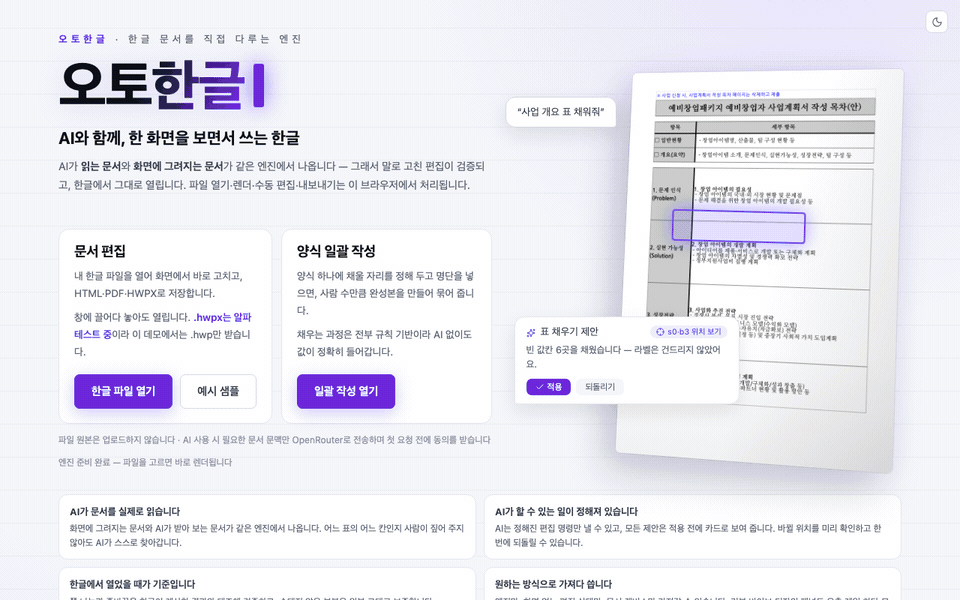
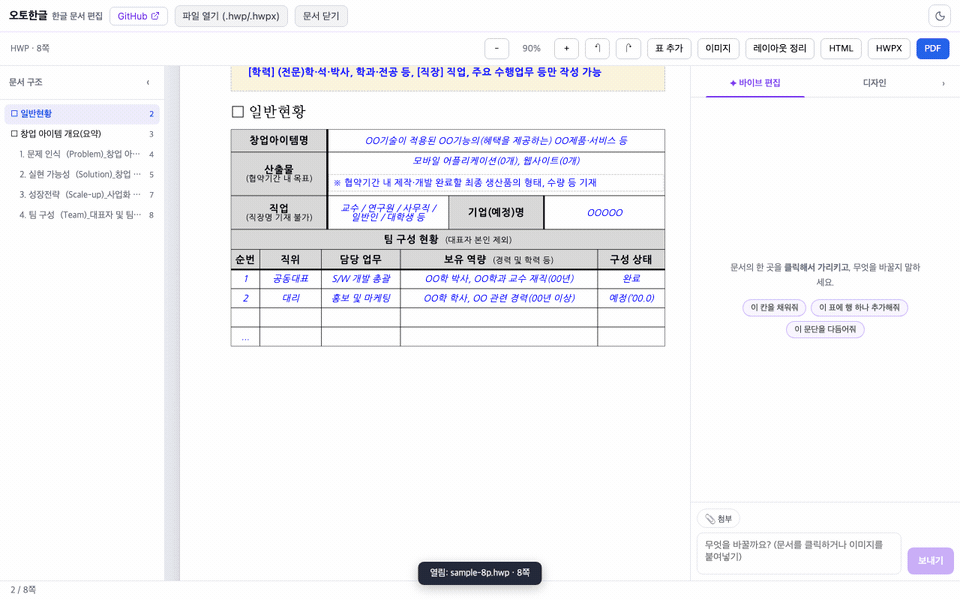
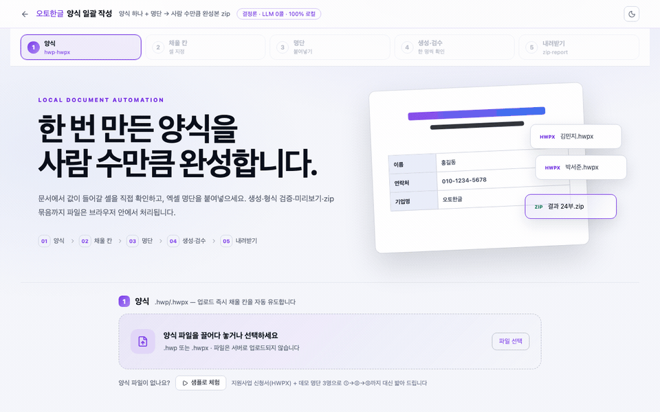

<p align="center"></p>

<p align="center">
  <a href="https://www.npmjs.com/package/@auto-hwp/react"></a>
  <a href="https://www.npmjs.com/package/@auto-hwp/react"></a>
  <a href="./LICENSE"></a>
</p>

# 오토한글 (auto-hwp)

한글(HWP·HWPX) 문서를 여는 **엔진**과, 그 엔진 위에 올린 **웹 에디터**입니다.
문서를 남의 서비스에 맡기지 않고 직접 구축합니다 — 브라우저에서 wasm으로 돌리든,
당신의 서버(개인 PC·사내망)에 올리든 같은 코어가 돕니다.

**체험** — [데모](https://autohwp.com/) · [양식 일괄 작성](https://autohwp.com/bulk) · [벤치마크](https://autohwp.com/bench)<br>
**통합** — [임베드](./docs/EMBED-GUIDE.md) · [셀프호스팅](./docs/SELF-HOST.md) · [CLI](./docs/CLI-GUIDE.md) · [MCP](./docs/MCP-GUIDE.md)<br>
**문서** — [설계 배경](./docs/WHY.md) · [LLM에게 맡길 때](./docs/LLM-GUIDE.md) · [기여](./CONTRIBUTING.md) · [English](./README.en.md)

## 바로 써보기

| 영상 | 무엇을 하는 장면인가 |
|---|---|
|  | **엔진** — 한글 파일을 열고, 원본 그대로 화면에 그리고, PDF·HTML·HWPX로 내보냅니다. AI가 전혀 개입하지 않는 기본 경로입니다. |
|  | **바이브 편집** — 고칠 자리를 지정하고 말로 지시하면 제안이 카드로 먼저 뜹니다. 승인한 카드만 문서에 닿고, 카드 단위로 되돌립니다. |
|  | **양식 일괄 작성** — 양식 1개와 명단 N행을 넣으면 완성본 N부가 zip으로 나옵니다. 규칙 기반이라 AI 없이 돕니다. |

### 체험 — 우리가 배포한 데모 (autohwp.com)

- **문서 편집**: 한글 파일을 열어 고치고 HTML·PDF·HWPX로 저장 → [열기](https://autohwp.com/)
- **양식 일괄 작성**: 양식 1개 + 명단 N행 → 완성본 N부 zip → [열기](https://autohwp.com/bulk) · [가이드](./docs/BULK-GUIDE.md)

파일은 브라우저를 벗어나지 않습니다. 데모에서 **AI 편집을 선택할 때만** 지시문과 문서 프로필·본문 발췌·표 문맥이 동의를 받은 뒤
우리 데모 서버를 거쳐 OpenRouter(GPT-5.6 Luna)로 갑니다(파일 원본은 보내지 않습니다). 오토한글(auto-hwp)은 원본 문서,
전송된 문맥, AI 응답을 자체 데이터베이스나 스토리지에 저장·보유하지 않습니다. 남용 방지용 IP·날짜별 횟수 키만 약 25시간
유지됩니다. 이 AI는 **우리가 비용을 내는 체험용**이라 일·IP 단위 한도가 걸려 있고, 데모는 현재 `.hwp`만 받습니다.
제품에 넣을 때는 아래처럼 당신 몫의 프록시를 두세요.

### 문서 하나로 가볍게 기여하기

내 문서를 브라우저에서 열어 레이아웃을 확인한 뒤, 편집 화면의 **레이아웃 문제 제보** 버튼으로 GitHub 이슈 초안을 열 수
있습니다. 파일명·본문·해시는 자동으로 들어가지 않으며, 형식과 비교 항목만 채워집니다. 공개 이슈는 GitHub에 남으므로
비공개 문서나 개인정보를 첨부하지 말고, 공개 양식이면 출처 URL과 “몇 쪽에서 무엇이 다른지”만 알려 주세요.

## 내 서비스에 붙이기

### AI 에이전트에게 연동 맡기기

Codex·Claude Code·Cursor 같은 코딩 에이전트에는 아래 문장을 그대로 붙여넣으세요. 전체 체크리스트는
[에이전트 시작 프롬프트 정본](./docs/launch/AGENT-PROMPT.md)에 있으며, 에이전트가 사이트 문서부터 읽고
stable 버전·로컬 처리 경계·실파일 smoke까지 확인하게 합니다.

```text
오토한글(auto-hwp)을 이 프로젝트에 통합해줘. 먼저 https://autohwp.com/llms.txt 와
https://autohwp.com/docs/llm, https://autohwp.com/docs/embed 를 읽고 문서에 없는 API는 추측하지 마.
AI 없는 로컬 문서 경로를 먼저 완성하고, 마지막에 실제 HWP/HWPX 열기·편집·내보내기를 검증해줘.
```

### npm — 60초

```bash
npm i @auto-hwp/react@0.0.4 @auto-hwp/ai-protocol@0.0.4
# react가 엔진·헤드리스 코어를 함께 설치하고, ai-protocol은 아래 BYOK 브리지에서 직접 import합니다
```

```tsx
import { useMemo, useState } from 'react';
import { HwpWorkspace, WasmAdapter, workspacePanel, type HwpWorkspaceProps } from '@auto-hwp/react';
import { buildDocContext } from '@auto-hwp/ai-protocol';
import '@auto-hwp/react/styles.css';

// LLM 호출은 당신 서버에서 — 이 저장소의 어떤 패키지도 API 키를 보지 않습니다(BYOK).
const askAi: HwpWorkspaceProps['onAiRequest'] = async (instruction, anchors, context) => {
  const res = await fetch('/api/hwp-edit', {
    method: 'POST',
    headers: { 'content-type': 'application/json' },
    body: JSON.stringify({
      instruction,
      anchors,
      docContext: buildDocContext(context, anchors), // 문서 데이터는 R5 펜스 안에 둡니다
    }),
  });
  const data = await res.json();
  return data.intents ?? [];             // HwpWorkspace 계약은 반드시 Intent[]
};

export function Editor() {
  // 인자 없음 = wasm을 jsDelivr에서 자기 버전으로 pin해 받습니다 (복사할 파일 0).
  const adapter = useMemo(() => new WasmAdapter(), []);
  const [doc, setDoc] = useState<{ bytes: Uint8Array; name: string } | null>(null);

  return (
    <div style={{ height: '100vh' }}>
      <input type="file" accept=".hwp,.hwpx" onChange={async (e) => {
        const f = e.currentTarget.files?.[0];
        if (f) setDoc({ bytes: new Uint8Array(await f.arrayBuffer()), name: f.name });
      }} />
      <HwpWorkspace
        adapter={adapter}
        document={doc}
        enableEditing
        onAiRequest={askAi}
        sidePanel={workspacePanel({ onAiRequest: askAi })}
      />
    </div>
  );
}
```

열기·조판·렌더·수동 편집·HTML/PDF/HWPX 내보내기가 이 컴포넌트 안에서 끝납니다. `sidePanel`을 빼면 패널 없는 순수
에디터입니다(그때 `onAiRequest`는 호출되지 않습니다). 오프라인·폐쇄망·엄격 CSP라면 wasm을 직접 서빙하세요 —
[EMBED-GUIDE §2.2](./docs/EMBED-GUIDE.md#22-오버라이드--자기-호스팅정적-파일-복사). 동작하는 앱은 [`examples/vite-embed`](./examples/vite-embed).

### AI 호출은 내 서버를 거칩니다 (BYOK)

위 `askAi`가 부르는 `/api/hwp-edit`은 우리 서버가 아니라 직접 띄운 서버입니다. 어떤 모델을 부를지, 키를 어디에 두고
로그와 한도를 어떻게 잡을지가 모두 그 안에서 결정되고, 우리 체험용 프록시는 이 경로에 아예 등장하지 않습니다. 바닥부터
만들 필요는 없어서 [`examples/ai-proxy-express`](./examples/ai-proxy-express)에 그대로 복사해 쓸 얇은 서버를 두었고,
프롬프트와 검증 규칙, 허용 명령 목록은 `@auto-hwp/ai-protocol`이 한곳에서 쥐고 클라이언트와 나눠 씁니다 — 서버와 화면이
서로 다른 규칙으로 도는 일이 없다는 뜻입니다. 엔진까지 사내 인프라에 들여놓는 이야기는
[SELF-HOST](./docs/SELF-HOST.md)에 Docker와 Node/Bun 두 갈래로 정리해 뒀습니다.

### CLI

```bash
cargo install --git https://github.com/kwakseongjae/auto-hwp auto-hwp-cli --features rhwp,shaper,pdf
```

변환·조판 검사·양식 일괄 작성이 터미널에서 로컬 실행됩니다 → [CLI 가이드](./docs/CLI-GUIDE.md). 에디터에
상시 장착하려면 [MCP 서버](./docs/MCP-GUIDE.md), 아무 세션에서 쓰려면 [Claude Code 스킬](./skills/hwp/SKILL.md).

## 프레임워크 — 무엇이 React이고 무엇이 아닌가

엔진(`@auto-hwp/engine`)과 헤드리스 코어(`@auto-hwp/editor-core`)는 **프레임워크를 가리지 않는 JS/wasm**입니다 — React도 DOM도 참조하지 않습니다.
`@auto-hwp/react`는 그 위에 올린 **React 에디터 컴포넌트 라이브러리**입니다. 당신의 React 앱에 `import` 해서 쓰는 물건이지,
auto-hwp를 쓰려고 React 앱을 새로 만들어야 한다는 뜻이 아닙니다. 다른 프레임워크는 엔진+코어로 오늘 바로 붙일 수 있고,
다만 **완성된 UI를 우리가 제공하는 건 아직 React 하나뿐**입니다.

| 스택 | 오늘 되는 것 | 시작점 |
|---|---|---|
| **React** | 완성 UI `<HwpWorkspace/>` — 페이지·선택·오버레이·수동 편집·패널 슬롯 | `@auto-hwp/react` → 위 quickstart |
| **바닐라 · Svelte · Vue** | 엔진 + 헤드리스 코어로 전 기능 사용 가능 — 화면만 직접 조립합니다 | [`editor-core/examples/vanilla.ts`](./packages/editor-core/examples/vanilla.ts) (열기→선택→편집→undo→export, React 없이) |
| **웹 컴포넌트 래퍼** | 아직 없습니다 (로드맵) | — |

패키지는 4층입니다 — `@auto-hwp/engine`(wasm 엔진) · `@auto-hwp/editor-core`(헤드리스 상태) · `@auto-hwp/ai-protocol`(AI
프로토콜, 네트워크·키 0) · `@auto-hwp/react`(선택 UI). 엔진만 쓰면 `HwpDoc.open` → `renderPageSvgSanitized` → `applyIntent`
→ `exportPdf`가 전부이고, 좌표 질의까지 포함한 **34개 메서드**가 [`EngineAdapter`
계약](./packages/editor-core/src/adapter.ts)에 정의돼 있어 자체 에디터를 지을 수 있습니다.

## 오토한글로 가능한 작업

| 작업 | 무엇을 주나 | API · CLI |
|---|---|---|
| **열기** | `.hwp`(HWP5)와 `.hwpx`를 자동으로 가려내 편집 가능한 문서 모델로 만듭니다. 배포용(DRM) 문서도 풉니다 | `HwpDoc.open` · `auto-hwp info` |
| **조판** | 한글의 조판 규칙을 다시 구현했습니다 — 금칙 처리, 장평·자간, 옛한글. 쪽이 넘어가면 표를 행 단위로 잘라 이어 그립니다 | `pageCount` · `auto-hwp layout-check` |
| **렌더** | 쪽마다 SVG 한 장을 돌려주고, 화면의 한 점이 어느 블록·표·셀·글자인지 되짚어 줍니다(커서 사각형 포함) | `renderPageSvgSanitized` · `hitTest` · `tableCellAt` |
| **편집** | 셀·문단 채우기, 표·문단·차트·이미지 삽입, 행 추가, 블록 이동과 삭제, 찾아바꾸기, 글자 서식, 표 열폭, 쪽 여백까지 — 모두 타입이 붙은 편집 명령(Intent)이고 하나가 되돌리기 한 단위입니다 | `applyIntent` · `undo`/`redo` |
| **문서&nbsp;프로필** | 제목·목차·표 인벤토리·본문 발췌를 LLM 호출 없이 결정론으로 뽑아냅니다. AI가 읽는 문맥의 정본입니다 | `docProfile` · `auto-hwp ai-context` |
| **내보내기** | PDF는 레이아웃을 지키고 한글 서체를 임베드하며, HTML은 의미 구조로 리플로하고, HWPX는 고치지 않은 영역을 바이트 그대로 둡니다 | `exportPdf`·`exportHtml`·`toHwpx` |
| **서체** | TTF/OTF를 등록하면 조판·화면·PDF가 동시에 그 서체로 바뀝니다. 카탈로그 8종은 전부 OFL이라 재배포와 PDF 임베딩이 적법합니다 | `registerFont` · [폰트 카탈로그](./docs/FONT-CATALOG.md) |
| **일괄&nbsp;작성** | 양식과 채울 자리 정의에 명단을 얹으면 완성본 N부와 행별 검증 리포트가 나옵니다 | `auto-hwp inspect`/`fill` · [가이드](./docs/BULK-GUIDE.md) |

AI에게 열려 있는 건 위 편집 명령 중 **19종**뿐이고, 스키마 검증을 통과한 것만 문서에 닿습니다 — 제안은 카드로 미리 보고
"위치 보기"로 확인한 뒤 승인하며 카드별로 되돌립니다(에이전틱 모드는 웹 검색→근거 인용까지). 프로토콜은 `@auto-hwp/ai-protocol`,
스펙 전문은 [INTENT-SCHEMA](./docs/INTENT-SCHEMA.md). 없는 것도 분명히 적습니다 — 표의 **행 삭제·열 삽입·열 삭제 명령은 아직 없습니다**.

## 오토한글의 철학

LLM에게 한글 문서를 주는 기존 방법은 결국 **텍스트 추출**입니다. 추출은 됩니다. 그런데 그 순간 문서가 둘로 갈라집니다 —
AI가 읽은 것(평문)과 사람이 보는 것(조판된 지면)이 서로 다른 표현이 됩니다. AI는 "세 번째 표의 빈칸"이 화면 어디인지
모르고, 고친 결과가 레이아웃을 깨뜨렸는지 아무도 보증하지 못합니다. 서식 자체가 곧 내용인 공문서와 신청서에서 이 간극은
치명적입니다.

그래서 파서도 뷰어도 아닌 **엔진을 소유**하기로 했습니다. 여는 것부터 저장하는 것까지 **하나의 문서 모델** 위에서 돕니다.

```
.hwp / .hwpx ──▶ 문서 모델 ──▶ 조판 ──▶ 페이지 SVG (화면 · 좌표 질의)
                    │                 ├▶ PDF (레이아웃 보존)
                    │                 └▶ 문서 프로필 · Markdown (AI가 읽는 창)
                    └── 편집 명령 ──▶ 문서 변경 (되돌리기 포함) ──▶ HWPX 저장
```

모델이 하나면 **AI가 읽는 것과 화면에 그려지는 것이 같아집니다**. 문서 프로필의 주소 `[s0/b3]`은 화면의 그 블록과 같은
좌표라서, 아무것도 표시하지 않고 "첫 번째 표에 행 추가해줘"라고 해도 정확한 블록에 꽂힙니다. 그리고 모델은 자유 텍스트가
아니라 **검증된 편집 명령만** 낼 수 있으니, 문서가 예상 못 한 방식으로 망가질 여지가 구조적으로 막힙니다.

남은 문제는 "그 조판이 정말 한컴과 같은가"입니다. 이건 주장으로 해결되지 않아서 **숫자로 잠갔습니다** —
쪽수와 줄바꿈 위치 일치율을 커밋마다 검사하고, 통과하지 못하면 아무것도 병합되지 않습니다
([정확도와 한계](#정확도와-한계)).

마지막으로, 이 저장소가 배포하는 것은 엔진과 SDK이지 **화면이 아닙니다**. 데모는 이 엔진으로 만든 참조 구현일 뿐이고,
참조 에디터조차 문서 표면만 소유합니다 — 오른쪽 패널은 슬롯이라 채팅을 넣든 입력 폼을 넣든 아무것도 안 넣든
호스트 마음입니다. 더 깊은 이야기는 [WHY](./docs/WHY.md)에 있습니다.

## 다른 오픈소스와의 차이

| | **auto-hwp** | rhwp | hwp.js |
|---|---|---|---|
| **라이선스** | Apache-2.0 — 상용 임베드 무료, 동시접속 제한 없음 | MIT | Apache-2.0 |
| React 네이티브 SDK | `@auto-hwp/react`의 `<HwpWorkspace/>` + 헤드리스 코어 | iframe 임베드 웹 컴포넌트(`@rhwp/editor`) | 뷰어·파서 라이브러리(`hwp.js`) |
| 양식 일괄 작성 완제품 | 웹 + CLI (양식 1개 + 명단 N행 → 완성본 N부 zip) | 확인되지 않음 | 확인되지 않음 |
| 바이브(자연어) 편집 | 타입드 편집 명령 19종 · 적용 전 카드 미리보기 · 카드별 되돌리기 | 확인되지 않음 | 확인되지 않음 |
| 충실도 자동 게이트 | 쪽수·줄바꿈 일치율을 커밋마다 검사 ([정확도](#정확도와-한계)) | 확인되지 않음 | 확인되지 않음 |
| 배포 표면 | npm · CLI · MCP 서버 · Claude Code 스킬 · 웹 데모 | 브라우저 확장 · VS Code 확장 · npm · 웹 데모 | npm |
| 최근 npm 릴리스 | `@auto-hwp/engine` 0.0.4 (2026-07) | `@rhwp/core` 0.8.2 (2026-07) | `hwp.js` 0.0.3 (2020-10) |

<sub>2026-07 기준, 각 프로젝트의 공개 저장소와 npm 레지스트리 메타데이터에서 확인한 것만 적었습니다. "확인되지 않음"은 공개
자료에서 찾지 못했다는 뜻이지 불가능하다는 뜻이 아닙니다. rhwp는 auto-hwp가 `.hwp` 파싱 부트스트랩으로 쓰는 상류이기도
합니다([크레딧](#라이선스--크레딧)).</sub>

2026년 5월 18일부터 지방정부 온나라시스템에도 개방형 포맷(HWPX) 첨부 의무가 확대됐습니다(중앙부처는 2022년부터,
[ZDNet](https://zdnet.co.kr/view/?no=20260512173412)). auto-hwp는 `.hwp`와 `.hwpx`를 같은 문서 모델로 열고 HWPX로
저장합니다 — 다만 `.hwpx` **입력**은 아직 알파입니다.

## 정확도와 한계

| 게이트 | 한컴 렌더 | auto-hwp |
|---|---|---|
| benchmark.hwp (정부 양식) | 8쪽 | 8쪽 |
| benchmark1.hwp (신청서) | 18쪽 | 18쪽 |
| 줄바꿈 위치 일치율 | — | 98.9%+ |
| 공공기관 실물 49종 ([출처](./corpus/GOV-SOURCES.md)) | — | 열기→렌더→PDF→텍스트 전 구간 통과 |

`scripts/verify-local.sh`가 매 커밋 이 게이트를 강제하고, 수치 전체와 각각을 직접 재현하는 명령은 **[벤치마크
페이지](https://autohwp.com/bench)** 에 공개돼 있습니다. 130쪽 문서에서 편집 → 화면 반영 136ms(워커
스레드, 화면 비차단), 되돌리기 메모리는 128MiB 버짓으로 상한이 잡혀 있습니다.

**산출 형태** — 결과물은 **HTML · PDF · HWPX** 세 가지이고, `.hwp`로 되돌려 저장하지는 않습니다. 즉 `.hwp → .hwp` 왕복이
아니라 `.hwp → (편집) → HTML/PDF/HWPX`입니다. 말로 지시한 편집이 문서를 어디까지 바꿨는지 매번 확인하려면 여는 것부터
내보내는 것까지가 하나의 문서 모델 위에 있어야 하는데, 그 모델을 닫힌 바이너리로 되쓰는 길은 검증이 가장 안 서는
방향이라 처음부터 접어 두었습니다.

**알려진 제약**
- **PDF의 수식·차트**: 화면·HTML에서는 실제로 그려지지만 PDF는 아직 **자리표시 상자**입니다(내보내기 전 경고).
- **암호 걸린 `.hwp`**: 지원하지 않고 정직하게 거부합니다(배포용 DRM 문서 복호는 지원).
- **`.hwp` 입력의 산출물은 변환본**: HWPX 입력은 고치지 않은 영역이 바이트 그대로 보존되지만, `.hwp`에서 온 문서는
  쪽 나눔·표 너비가 달라질 수 있습니다. (한컴 "다른 이름으로 저장"이 뭉갠 손실 `.hwpx`는 **레이아웃 정리** 모드가
  열화를 감지해 원본 근사로 복원합니다.)
- 쪽수 게이트는 위 벤치마크 기준입니다 — 임의 문서에 대한 완전 일치 보증이 아닙니다.

## 문서

| 문서 | 내용 |
|---|---|
| [EMBED-GUIDE](./docs/EMBED-GUIDE.md) · [SELF-HOST](./docs/SELF-HOST.md) | 번들러별 wasm/워커 서빙·CSP·폰트·패널 슬롯 API 전체 · 엔진을 당신 인프라에 올리기(Docker · Node/Bun) |
| [CLI-GUIDE](./docs/CLI-GUIDE.md) · [MCP-GUIDE](./docs/MCP-GUIDE.md) | 터미널 실행 · 에디터 상시 장착 |
| [BULK-GUIDE](./docs/BULK-GUIDE.md) · [INTENT-SCHEMA](./docs/INTENT-SCHEMA.md) | 양식 일괄 작성(웹·CLI) · 편집 명령 스펙 전문 |
| [LLM-GUIDE](./docs/LLM-GUIDE.md) · [llms.txt](./llms.txt) | 이 저장소를 LLM/코딩 에이전트에게 맡길 때 먼저 읽힐 것 |
| [BENCHMARK](./docs/BENCHMARK.md) · [FONT-CATALOG](./docs/FONT-CATALOG.md) | 게이트 수치와 재현 명령 · 번들 서체 8종과 라이선스 |
| [WHY](./docs/WHY.md) | 왜 엔진을 직접 만들었나 · 파이프라인 · 설계 노트 · 크레이트 지도 · 로컬 빌드 |
| [SDK-LAYERS](./docs/SDK-LAYERS.md) · [CONTRIBUTING](./CONTRIBUTING.md) | 레이어 계약 · 검증 스위트와 불변식 · 로컬 벤치 돌려 결과 기여하기 |

## 라이선스 · 크레딧

**Apache-2.0** ([LICENSE](./LICENSE)) — 상용 제품에 임베드해도 사용료·좌석 수·동시접속 제한이 없습니다.

이 프로젝트는 앞선 작업들의 어깨를 빌렸습니다.

- **[rhwp](https://github.com/edwardkim/rhwp)** (MIT) — 바이너리 `.hwp` 파싱의 상류이자 이 엔진을 시작하게 만든 영감입니다.
  파싱 부트스트랩과 조판 참조로 쓰고, 렌더는 항상 우리 IR에서 합니다.
- **나눔고딕 · 나눔명조** (OFL, NAVER) — 기본 화면·PDF 서체. 카탈로그 8종 전부 OFL이라 재배포와 임베딩이 적법합니다.
- **LibreOffice + H2Orestart** (GPL) — 충실도 대조용 오라클로 프로세스 **밖에서만** 호출합니다. 배포되는
  바이너리·npm 패키지에는 GPL 코드가 들어가지 않습니다.
- **공개 배포된 정부 양식과 포맷 적합성 테스트 문서** — 파서·조판기 회귀 테스트의 근거가 됩니다.

전체 고지는 [NOTICE](./NOTICE), 기여 규칙과 정확도 게이트는 [CONTRIBUTING.md](./CONTRIBUTING.md).
